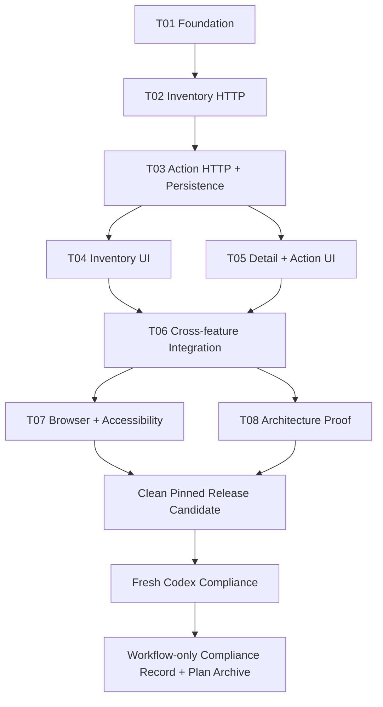

# Execution Plan: Intelligent Inventory Dashboard Delivery

Date: 2026-09-10

## Status

Active

## Outcome

Deliver the approved Scenario B Intelligent Inventory Dashboard implementation end to end: a production-quality responsive React frontend backed by an HTTP-faithful MSW mock backend, with traceable automated/observable evidence for every implementation requirement and a final fresh Codex Compliance `RELEASE: PASS` verdict.

This plan is the single durable delivery state for the autonomous run. Repository state and executable/observable evidence outrank agent/session claims.

## Authority And Bootstrap Context

Primary authority:

- `docs/system-design/system-design-v1.md` — product and architecture authority.
- `docs/decisions/0001-mock-implementation-baseline.md` — accepted implementation authority for current-inventory membership/action eligibility, note validation, demo timezone/freshness defaults, and mock authorization.
- `AGENTS.md` — repository role/authority boundary.
- `docs/agents/ORCHESTRATION.md` — lifecycle/state machine.
- `docs/agents/BRANCHING.md` — task base/contract/worktree/review provenance.
- `docs/agents/QUALITY_AND_LEARNING.md` — task/release proof.
- `docs/agents/RUNTIME.md` — model/effort/runtime policy.
- `docs/agents/TASK_CONTRACT_TEMPLATE.md` — bounded worker handoff.

Bootstrap facts:

- `bootstrap_authority_commit`: `01f77f125d9bea65d9ea9b71108efe7deeddbf3f`.
- At that commit the repository contains workflow/design material but no application implementation at the repository root.
- The prior read-only dry run produced a 49-requirement registry and an acyclic T01–T08 decomposition. This plan normalizes that result against the accepted decision above rather than recompiling the design during normal orchestration.
- Herdr IPC has been runtime-verified from Codex Lead as `HERDR_RUNTIME_OK`.
- AGY runtime identifiers are pinned in `docs/agents/RUNTIME.md`.
- Codex remains logically repository-mutation read-only even when runtime sandbox permissions are broader for Herdr IPC.

## Scope Classification

### IMPLEMENT

- React/TypeScript application and selected TanStack stack.
- Responsive desktop/tablet/mobile inventory dashboard.
- URL-owned filters, sorting, and pagination.
- Vehicle detail, current action, action creation, action history.
- Optimistic action creation and rollback.
- Loading, empty, failure, freshness/stale states.
- Accessibility behavior.
- Client instrumentation boundary.
- Unit, integration, E2E, and architecture proof required by repository quality gates.

### SIMULATE_AT_HTTP_BOUNDARY

- All seven designed REST endpoints.
- Inventory reads, filtering, sorting, pagination, detail, summary, and filter options.
- Dealership-local aging derivation and action eligibility.
- Dynamic action statuses.
- Append-only action creation/history/current-action semantics.
- Trusted mock actor/authorization behavior.
- Browser-persistent mocked actions.
- Stable API errors and freshness scenarios.

### DESIGN_ONLY

Do not implement production Fastify/Prisma/PostgreSQL, production synchronization workers/transactions, real IdP integration, observability infrastructure, CDN/infrastructure provisioning, distributed cache, microservices, or future ingestion/search/analytics architecture.

## Evidence Legend

- `S` — static repository proof: install/lockfile contract, typecheck, lint, build.
- `U` — domain/unit proof.
- `H` — HTTP/MSW contract proof.
- `I` — React Testing Library + MSW integration proof.
- `E` — Playwright/browser proof.
- `A` — architecture/invariant proof, including positive and negative cases where practical.
- `O` — observed accessibility/instrumentation behavior.

Risk levels: `C` critical, `H` high, `M` medium.

## Requirement Registry

| ID | Testable requirement | Risk | Primary task | Required evidence |
|---|---|---:|---|---|
| ARCH-HTTP-001 | Frontend feature data access crosses the HTTP/API abstraction; feature code cannot access mock storage/repositories directly. | C | T01 | I, A |
| ARCH-STATE-001 | TanStack Query owns server data; React local state is limited to transient UI state. | H | T01 | I, A |
| TECH-001 | Use the selected React, TypeScript, TanStack Router/Query/Table, MSW, Vitest/RTL, and Playwright stack. | M | T01 | S |
| ERR-001 | Preserve the `ApiError` contract with stable `code`, `message`, `requestId`, and optional `details`. | H | T01 | H |
| TEST-001 | Establish a committed runtime/lockfile contract and repository-owned typecheck/lint/test/build commands. | H | T01 | S |
| ARCH-DOM-001 | Stable `vehicleId` connects inventory and actions through explicit interfaces; VIN is not relational identity. | C | T02 | H, A |
| AGE-001 | Calculate age in dealership-local calendar days; aging is strictly `inventoryAgeDays > 90`. | C | T02 | U, H |
| AGE-002 | Derive `inventoryAgeDays`/`isAging` behind HTTP; frontend feature code does not persist or independently recompute them. | C | T02 | H, A |
| INV-001 | Apply all documented vehicle filters behind the HTTP boundary before pagination. | H | T02 | H |
| INV-002 | Sort behind HTTP, defaulting to `inventoryAgeDays DESC`. | H | T02 | H |
| INV-003 | Return page-based vehicle lists with complete pagination and freshness metadata. | H | T02 | H |
| INV-004 | Retrieve a vehicle by stable ID using the designed frontend-facing vehicle view. | H | T02 | H |
| INV-006 | Return dynamic make/model options, including make-specific model narrowing. | M | T02 | H |
| INV-007 | Keep lifecycle distinct from latest-snapshot presence and expose deterministic freshness fixtures. | H | T02 | H |
| TEST-002 | Prove 89/90/91-day boundaries plus at least one non-UTC dealership-local calendar boundary. | C | T02 | U |
| INV-005 | Return total inventory, aging vehicles, aging-with-action, and freshness summary values. | H | T03 | H |
| STAT-001 | Fetch active action statuses dynamically from the HTTP boundary. | H | T03 | H, I |
| STAT-002 | Preserve historical status identities and deactivation semantics. | C | T03 | H |
| ACT-001 | Actions are immutable/append-only; newest server-generated action is current; no update/delete behavior exists. | C | T03 | H, A |
| ACT-002 | Return complete immutable action history newest-first. | H | T03 | H |
| ACT-003 | Action POST accepts status/note only while identity, timestamp, and trusted actor snapshot are generated behind HTTP. | H | T03 | H |
| ACT-004 | Reject missing, not-currently-present, or non-aging action targets according to accepted eligibility authority. | C | T03 | U, H |
| ACT-005 | Reject missing or inactive statuses. | H | T03 | U, H |
| ACT-006 | Enforce the accepted binary mock authorization contract and accepted optional-note API shape. | H | T03 | H |
| ACT-007 | Persist manager actions across browser reload independently of inventory projection replacement. | C | T03 | H, E |
| UI-001 | Show required KPIs, prominent non-color-only AGING status, oldest-first default ordering, and aging shortcut. | M | T04 | I, E |
| UI-002 | Provide every designed filter, removable active-filter chips, clear-all, and dependent model options. | M | T04 | I |
| UI-003 | Restore filters/sort/page from URL; changing a filter resets page to 1. | M | T04 | I, E |
| UI-004 | Use server-controlled TanStack Table operations with bounded page rendering rather than client re-filtering a returned page. | H | T04 | I, A |
| RESP-001 | Render full desktop table, compact tablet table, and prioritized mobile cards. | M | T04 | E, O |
| RESP-002 | Provide desktop inline filters and adaptive tablet/mobile filter sheets. | M | T04 | E, O |
| UI-STATE-002 | Distinguish empty inventory from no filter matches using the specified messages. | M | T04 | I |
| A11Y-001 | Use semantic table markup, labelled controls, readable status text, and non-color-only aging communication. | H | T04 | I, O |
| DETAIL-001 | Detail surface presents vehicle summary, current action, create-action form, then action history. | M | T05 | I, E |
| RESP-003 | Use desktop drawer, tablet wide sheet, and mobile fullscreen detail behavior. | M | T05 | E, O |
| DETAIL-002 | Show current action in inventory and status/actor/time/note history in detail. | M | T05 | I |
| ACT-008 | Populate the action form from dynamically fetched active statuses. | H | T05 | I |
| ACT-009 | Optimistically update current action, reconcile authoritative success, and restore prior state on failure. | H | T05 | I |
| ERR-002 | Frontend business/error behavior branches on stable `ApiError.code` and contains expected failures regionally. | H | T06 | I |
| OBS-001 | Provide client-error/Web-Vitals instrumentation boundary while excluding free-text action notes from general telemetry/logging. | H | T06 | I, O |
| ACT-010 | Keep list/detail/history/summary server-state views coherent after successful mutation and rollback. | H | T06 | I, E |
| UI-STATE-001 | Show localized loading skeletons rather than replacing the whole application. | M | T06 | I, E |
| UI-STATE-003 | Contain API failures to the smallest reasonable region and provide retry behavior. | H | T06 | I |
| UI-STATE-004 | Retain previous inventory, show last update, and warn when the configured freshness threshold is exceeded. | H | T06 | I, E |
| TEST-003 | Prove required cross-feature frontend behaviors through RTL + MSW integration tests. | H | T06 | I |
| A11Y-002 | Prove keyboard navigation, visible/restored focus, accessible validation, and sufficient touch targets. | H | T07 | E, O |
| TEST-004 | Prove filter → aging vehicle → detail → create action → current/history → reload persistence across desktop/tablet/mobile viewports. | H | T07 | E |
| ARCH-SCOPE-001 | Mechanically/independently verify production backend/infrastructure and other design-only scope were not implemented. | C | T08 | A |
| TEST-005 | Mechanically check accepted architecture boundaries with allowed and forbidden cases where practical. | C | T08 | A |

All 49 requirements begin `PLANNED`; task state and evidence, not this registry text, advance them.

## Capability Map

- **E0 — Foundation**
  - S0.1 Runnable typed HTTP-based frontend foundation → T01.
- **E1 — Inventory**
  - S1.1 Authoritative mock inventory read model and aging → T02.
  - S1.2 Responsive inventory discovery dashboard → T04.
- **E2 — Manager Actions**
  - S2.1 Persistent immutable mock action service → T03.
  - S2.2 Responsive detail/action creation/history UI → T05.
- **E3 — Cross-feature Integration**
  - S3.1 Cache/error/freshness/loading/instrumentation coherence → T06.
- **E4 — Verification And Compliance**
  - S4.1 Browser/accessibility primary-journey proof → T07.
  - S4.2 Architecture invariant proof → T08.
  - S4.3 Clean release candidate + fresh final compliance → release gates.

## Task State And Dependency DAG

| Task | Outcome boundary | Dependencies | Risk | State |
|---|---|---|---:|---|
| T01 | Runnable React/TS + Router/Query + typed HTTP/MSW + test/build foundation | none | C | DONE |
| T02 | Authoritative mock inventory reads, aging, filters/sort/page/options/detail | T01 DONE | C | READY |
| T03 | Persistent append-only action/status service and summary completion | T02 DONE | C | PLANNED |
| T04 | Responsive inventory dashboard and URL-owned discovery UX | T03 DONE | H | PLANNED |
| T05 | Responsive detail/action form/history + optimistic mutation | T03 DONE | H | PLANNED |
| T06 | Cross-feature consistency, errors, freshness, loading, instrumentation | T04 + T05 DONE | H | PLANNED |
| T07 | Browser/accessibility proof across desktop/tablet/mobile | T06 DONE | H | PLANNED |
| T08 | Architecture/scope invariant proof | T06 DONE | C | PLANNED |



Execution waves:

- Wave 0a: T01.
- Wave 0b: T02.
- Wave 0c: T03.
- Wave 1: T04 and T05 may run in parallel only after Lead verifies their path/seam ownership is independent.
- Wave 2: T06.
- Wave 3: T07 and T08 may run in parallel because their verification surfaces are independent.
- Wave 4: clean pinned release candidate, fresh Compliance, then workflow-only compliance record/archive.

Current ready frontier: **T02 only**.

T01 integrated state: base `c166671e61df0d36617090f226a4ffaf79960c23`; implementation `2b15a1519ddfe5ed805a97341099e617b22eca93`; tooling repair `6ccd5a615643469c82e21ff2bd1faa69844f4b17`; integration commits `55fe9416ebf8d4b24bab338f53400d2446aa9081` and `46a90b93c085050126b04bc48769d7fc2aa1cd4a`; evidence `docs/agents/evidence/T01.md`.

Do not pre-fill future task `base_commit` values. A dependent task captures its base only after dependencies are integrated and verified.

## T01 Dispatch Specification

This section is bootstrap input for Codex Lead. It is not the canonical Task Contract. Before dispatch, Lead must capture the actual coordination-branch HEAD and compile/persist `docs/agents/tasks/T01.md` according to `docs/agents/BRANCHING.md`.

### Objective

Create the smallest runnable frontend foundation that establishes the selected technology stack, typed HTTP boundary, MSW integration seam, Router/Query ownership, and repository-native validation commands without implementing inventory/action business behavior.

### Requirements

- `ARCH-HTTP-001`
- `ARCH-STATE-001`
- `TECH-001`
- `ERR-001`
- `TEST-001`

### Authority References

- `docs/system-design/system-design-v1.md` §5.1 Core REST endpoints.
- `docs/system-design/system-design-v1.md` §5.8 Error contract.
- `docs/system-design/system-design-v1.md` §6.1 State ownership.
- `docs/system-design/system-design-v1.md` §6.11 Mock backend.
- `docs/system-design/system-design-v1.md` §7.1 Frontend.
- `docs/agents/QUALITY_AND_LEARNING.md` Gate A and architecture-proof expectations.

### Rules To Load

- `AGENTS.md` Keyloop Challenge Autonomous Workflow.
- `docs/agents/QUALITY_AND_LEARNING.md` Definition of Done — Task; Gate A; Autonomous TDD Compatibility.
- `docs/agents/BRANCHING.md` Dispatch Sequence.
- Any promoted project rule whose `applies_when` explicitly matches T01; otherwise none.

### Dependencies

None. Before contract persistence, Lead must capture:

```text
B = current coordination-branch HEAD
```

The Builder branch/worktree must start from `B`, not from the later Task Contract/Scribe commit.

### Allowed Scope

Because the repository has no application scaffold yet, T01 may create the minimum conventional frontend/runtime/test surface required for the selected stack, including:

- root package manifest and exactly one committed package-manager lockfile;
- TypeScript/build/lint/test configuration;
- minimal application entry/bootstrap files;
- TanStack Router and TanStack Query provider/bootstrap wiring;
- typed HTTP client/API contract primitives, including the stable `ApiError` shape;
- MSW browser/test bootstrap and handler-composition seam without domain behavior;
- Vitest + React Testing Library foundation;
- Playwright configuration/bootstrap only, if needed to establish the committed test contract;
- minimal placeholder route/screen necessary to prove application startup;
- test helpers required to prove the public seams below.

Package-manager and build-tool selection are reversible internal implementation choices because repository/product authority does not pin them. The Builder must choose a stable conventional setup, commit its lockfile, expose deterministic scripts, and report the choice in evidence; it must not invent product behavior to justify tooling.

### Out Of Scope

T01 must not implement:

- inventory fixtures/domain filtering/sorting/pagination/aging behavior;
- action statuses, action history, action persistence, eligibility, authorization, or mutations;
- dashboard KPIs, inventory table/cards, filters, detail UX, or action forms;
- production Fastify/Prisma/PostgreSQL/sync/IdP/observability infrastructure;
- broad design-system work or speculative abstractions not required by the foundation.

### Pre-agreed Test Seams

These are authoritative TDD seams for T01:

1. **Application bootstrap seam:** a user/test can render or start the app through its real Router + Query provider composition without runtime failure.
2. **HTTP client seam:** a caller can issue an API request through the shared HTTP abstraction and receive typed success/error handling; stable `ApiError.code` is preserved without message parsing.
3. **MSW boundary seam:** development/test mocking intercepts HTTP requests; application/feature-facing code has no direct mock-repository/storage API.
4. **Server-state ownership seam:** fetched server data is represented through TanStack Query rather than duplicated into a second independent app-level store.
5. **Repository command seam:** a clean install from the committed lockfile exposes deterministic scripts for typecheck, lint, tests, and build.

### Acceptance

T01 is acceptable only when all are observable from the committed task branch:

- A minimal React + TypeScript application starts/builds successfully.
- TanStack Router and TanStack Query are wired at the application boundary.
- The selected frontend/test dependencies from System Design are present or their configuration seam is established without implementing later-task behavior.
- A shared typed HTTP abstraction exists; consumers do not import a mock repository/storage layer.
- `ApiError` preserves stable `code`, `message`, `requestId`, and optional `details` semantics.
- MSW is wired at the HTTP boundary for development/tests with a clear place for T02/T03 handlers.
- Vitest + RTL can run a minimal behavior-oriented test through declared public seams.
- A committed lockfile exists and package scripts provide deterministic `typecheck`, `lint`, `test`, and `build` equivalents.
- The task introduces no inventory/action business implementation and no production backend/infrastructure.
- Builder returns one coherent implementation commit plus a concise evidence capsule with exact changed paths and validation results.

### Required Validation

The canonical T01 Task Contract should replace placeholders below with the exact scripts established by the Builder where needed, then evidence must run the repository-owned equivalents of:

```text
clean install from committed lockfile
typecheck
lint
unit/integration test foundation
build
```

Additionally verify:

- one positive HTTP/MSW interception case;
- one stable `ApiError.code` handling case;
- source/import inspection sufficient to show app-facing code crosses HTTP rather than mock storage directly;
- `git diff <base_commit>...<task_commit>` stays within T01 scope.

### Forbidden

- Change System Design or accepted product semantics.
- Modify Harness-managed/core files for convenience.
- Implement T02+ business behavior early.
- Add direct React-feature access to browser storage or a mock repository.
- Add a second server-state store alongside TanStack Query.
- Introduce production backend/infrastructure code.
- Weaken validation to make the scaffold pass.
- Perform unrelated cleanup.

### Expected Output Capsule

```yaml
task: T01
status: complete|blocked
base_commit: <captured SHA>
commit: <implementation SHA or none>
requirements:
  ARCH-HTTP-001: implemented|blocked
  ARCH-STATE-001: implemented|blocked
  TECH-001: implemented|blocked
  ERR-001: implemented|blocked
  TEST-001: implemented|blocked
changed:
  - <path>
validation:
  install: PASS|FAIL|NOT_RUN
  typecheck: PASS|FAIL|NOT_RUN
  lint: PASS|FAIL|NOT_RUN
  unit: PASS|FAIL|NOT_RUN
  build: PASS|FAIL|NOT_RUN
scope_expansion: []
design_deviations: []
risks: []
blockers: []
```

## Dispatch/Review Protocol For Every Task

1. Lead computes the READY frontier from this plan.
2. Lead captures current coordination HEAD `B` before Task Contract persistence.
3. Lead compiles exact Task Contract with authority, requirements, seams, scope, acceptance, validation, and `base_commit: B`.
4. AGY Workflow Scribe persists the contract on the coordination branch.
5. Builder worktree starts from `B` and receives the bounded contract explicitly.
6. Lead verifies implementation commit, scope diff, and Builder capsule.
7. Fresh Codex Reviewer reviews against `B` and the contract/authority, not Builder reasoning.
8. Required targeted tests run; findings route to bounded repair and back through affected review/test gates.
9. AGY Integrator applies reviewed work onto current coordination branch.
10. Lead verifies integrated state; Scribe persists evidence and plan transition separately.
11. Only then may dependent tasks enter READY.

## Risks And Recovery

- **Foundation overreach:** T01 could implement domain behavior prematurely. Mitigation: strict T01 out-of-scope/acceptance above; review diff against captured base.
- **Parallel overlap:** T04/T05 or T07/T08 may touch shared files. Mitigation: parallelize only after Lead checks actual path/seam ownership; serialize when overlap is material.
- **Workflow-record contamination:** Scribe commits can pollute task diffs. Mitigation: follow pre-contract `base_commit` protocol and Builder-from-base rule exactly.
- **Agent/session crash:** do not redispatch based on pane status. Reconcile contract base, branch/worktree commits, coordination HEAD, evidence, and Herdr state first.
- **Flaky browser proof:** do not retry-until-green. Preserve original failure, classify nondeterminism, repair or keep release blocked.
- **Runtime usage pressure:** normal Codex orchestration uses the pinned medium-effort policy; escalate only for bounded material review/diagnosis difficulty.
- **Permission breadth:** Codex runtime may have broad filesystem permission for Herdr IPC but remains logically mutation-read-only; unexpected Codex-created repository changes are a workflow violation and must be removed/reconciled before advancing.

Recovery principle: do not delete uncertain branches/worktrees/state. Repository/Git/evidence decide recovery, not process liveness.

## Progress

- [x] System Design approved.
- [x] Autonomous role/branching/quality/runtime contracts established.
- [x] Herdr IPC verified from Codex Lead.
- [x] AGY model identifiers verified and pinned.
- [x] Four dry-run implementation authority gaps resolved by accepted Decision 0001.
- [x] 49-requirement registry normalized.
- [x] T01–T08 DAG normalized; T01 identified as sole READY frontier.
- [x] T01 dispatch specification prepared.
- [x] Lead captures post-bootstrap-plan T01 `base_commit`.
- [x] Scribe persists canonical `docs/agents/tasks/T01.md`.
- [x] T01 implementation/review/test/integration/evidence reaches DONE.
- [ ] T02 reaches DONE.
- [ ] T03 reaches DONE.
- [ ] T04 and T05 reach DONE.
- [ ] T06 reaches DONE.
- [ ] T07 and T08 reach DONE.
- [ ] Clean release-candidate verification passes.
- [ ] Fresh Codex Compliance records no FAIL/UNVERIFIED and returns `RELEASE: PASS`.
- [ ] Workflow-only compliance record is persisted and its post-pass diff verified.
- [ ] This plan is moved to `docs/plans/completed/` with release evidence reference.

## Release Gate State

| Gate | State | Required terminal evidence |
|---|---|---|
| Task acceptance | PENDING | scoped commits + accepted capsules + fresh review + required targeted tests |
| A — Static repository proof | PENDING | clean install + typecheck + lint + build |
| B — Business-rule unit proof | PENDING | 89/90/91 + timezone boundary + inactive status/eligibility proof |
| C — Frontend integration | PENDING | required RTL + MSW behaviors |
| D — Browser E2E | PENDING | primary flow + reload persistence on desktop/tablet/mobile |
| E — Architecture compliance | PENDING | accepted-boundary positive/negative/mechanical evidence |
| Clean candidate | PENDING | fresh checkout at pinned SHA; all applicable gates pass |
| Final Compliance | PENDING | fresh Codex Compliance matrix has no FAIL/UNVERIFIED |
| Post-pass provenance | PENDING | workflow-record-only diff after audited release candidate |

## Decisions

- 2026-09-10: Preserve the prior dry-run 49-requirement/T01–T08 decomposition rather than spend runtime usage recompiling it; normalize only against current repository authority.
- 2026-09-10: Keep T01 foundation-only; inventory/action semantics remain owned by T02/T03.
- 2026-09-10: Do not preselect package manager/build tool as product authority. T01 Builder may choose a stable conventional setup as a reversible implementation detail, but must commit one lockfile and deterministic repository commands.
- 2026-09-10: Do not pre-create canonical future Task Contracts because their truthful `base_commit` values depend on the integrated coordination state at dispatch time.

Lasting mock product/behavior decisions remain in `docs/decisions/0001-mock-implementation-baseline.md`, not duplicated as new product authority here.

## Validation

Bootstrap-plan validation:

- current authority and workflow contracts inspected;
- active plan absence verified before creation;
- current repository root inspected and no application scaffold observed;
- requirement registry count: 49 unique IDs;
- all 49 requirements have one primary task owner;
- DAG is acyclic with T01 as the sole initial frontier;
- T01 has explicit authority references, scope, exclusions, test seams, acceptance, validation, and evidence shape;
- no implementation `base_commit` is fabricated before the plan commit exists.

Product validation remains pending and must come from implementation/test/runtime evidence according to the release gates above.

## Result

Pending. This plan remains active until the pinned release candidate passes fresh final Compliance and the post-pass workflow-record provenance check completes.
