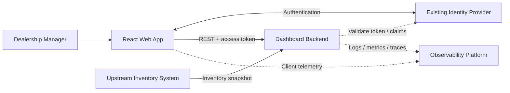
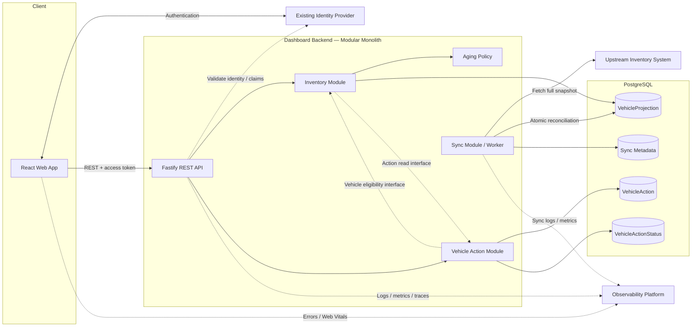

# System Design Document — Intelligent Inventory Dashboard

> **Scenario:** B — The Intelligent Inventory Dashboard  
> **Domain:** Supply  
> **Design scope:** End-to-end system architecture  
> **Implementation scope:** Frontend implemented fully; backend mocked at the HTTP boundary  
> **Status:** Final submission  
> **Version:** 1.0

---

## 1. Problem, Scope & Assumptions

### 1.1 Problem

Dealership managers need a fast way to understand current vehicle inventory, identify vehicles that have remained in stock for more than 90 days, and record actions for those vehicles.

The dashboard provides an operational layer over existing inventory data:

- view and filter current inventory;
- automatically identify aging vehicles;
- prominently surface vehicles requiring attention;
- record and persist manager actions;
- retain action history for accountability and future analysis.

### 1.2 Scope

#### System design scope

The design covers:

- responsive web application;
- REST API;
- inventory read model;
- aging business rule;
- manager action persistence and history;
- synchronization with an upstream inventory system;
- authentication boundary;
- observability;
- deployment and scaling considerations.

#### Implementation scope

The frontend is implemented fully. The backend is mocked at the HTTP boundary while preserving the designed API contract and behavior.

The frontend implementation covers:

- filterable vehicle inventory;
- prominent aging-stock identification;
- responsive desktop, tablet, and mobile experiences;
- vehicle details;
- current manager action;
- action creation;
- action history;
- loading, empty, stale-data, and failure states;
- persistence of mocked manager actions across browser reloads.

#### Out of scope

- production backend implementation;
- upstream dealership inventory system implementation;
- identity-provider implementation;
- automated pricing decisions;
- AI/ML vehicle recommendations;
- approval workflows;
- notifications.

### 1.3 Key assumptions

#### A1 — Existing inventory source

Vehicle inventory already exists in an upstream dealership inventory system.

The dashboard does not replace that system. Vehicle information is consumed as read-only upstream-owned data.

#### A2 — Vehicle lifecycle

The upstream system exposes stable vehicle records and lifecycle status rather than only a transient list of currently available vehicles.

A vehicle may move through states such as:

`AVAILABLE → RESERVED → SOLD / UNAVAILABLE`

The local projection retains known vehicle records even when their lifecycle changes.

#### A3 — Stable vehicle identity

The upstream system provides a stable vehicle identifier across synchronization runs.

VIN remains a business identifier, while the stable upstream vehicle identifier is used for persistence relationships.

#### A4 — Inventory age

Inventory age starts on the calendar date when the vehicle enters dealership inventory, represented by `stockedAt`.

Age is measured in calendar days using the dealership-local timezone.

A vehicle is aging only when:

`inventoryAgeDays > 90`

Therefore:

- 89 days → not aging;
- 90 days → not aging;
- 91 days → aging.

#### A5 — Aging is derived state

`inventoryAgeDays` and `isAging` are not persisted as source data.

They are derived by the backend from:

`stockedAt + current dealership-local date + aging policy`

The backend is the source of truth for aging classification so all clients receive the same business result.

#### A6 — Real-time means operational freshness

“Real-time overview” is interpreted as operationally fresh inventory data rather than sub-second consistency.

Inventory is synchronized periodically from the upstream source into a local read projection. The UI exposes the last successful synchronization time so users can judge data freshness.

The exact synchronization interval is configurable.

#### A7 — Manager actions are dashboard-owned data

Manager-created actions belong to the dashboard, not the upstream inventory system.

Inventory data and manager actions therefore have different ownership even though they are related by vehicle identity.

#### A8 — Manager actions retain history

Manager actions are append-only.

Creating a new action does not overwrite the previous action. The newest action represents the current action while older actions remain available as history.

Each action records:

- vehicle;
- configured action status;
- optional note;
- creation timestamp;
- actor identity;
- actor display-name snapshot.

Action statuses are database-driven reference data. Existing status identities are not deleted or repurposed when business terminology changes; obsolete statuses are deactivated instead.

#### A9 — Existing identity system

Users are assumed to already be authenticated by an external identity provider.

The frontend obtains an access token and sends it to the backend. The backend validates token identity/claims and applies authorization.

Authentication itself is outside the implementation scope.

### 1.4 Primary design consequences

1. **Vehicle inventory is upstream-derived data.**  
   The local `VehicleProjection` is synchronized from the upstream system and can be reconciled from it.

2. **Manager actions are owned data.**  
   `VehicleAction` history must not be destroyed by inventory synchronization.

3. **Aging is a business rule, not stored mutable state.**  
   Classification is calculated consistently by the backend.

4. **Freshness and consistency are explicit trade-offs.**  
   The system prefers a slightly stale but internally consistent inventory projection over exposing a partially synchronized snapshot.

---

## 2. Design Goals & Key Decisions

### 2.1 Quality attributes

The design prioritizes:

1. **Correctness**
2. **Reliability and consistency**
3. **Performance**
4. **Maintainability**
5. **Observability**
6. **Scalability**
7. **Accessibility and responsive UX**

### 2.2 Key architectural decisions

#### Decision 1 — Local inventory projection

**Decision:** Read inventory from a locally synchronized `VehicleProjection`.

**Why:** Decouples dashboard availability and query performance from upstream latency and outages.

**Trade-off:** Inventory may be slightly stale between synchronization runs.

#### Decision 2 — Full snapshot synchronization with atomic reconciliation

**Decision:** Fetch a complete upstream snapshot, validate it, and reconcile atomically.

**Why:** Simpler correctness model for dealership-scale data; avoids cursor/checkpoint and drift complexity.

**Trade-off:** More bandwidth and database writes than incremental synchronization.

#### Decision 3 — Backend-derived aging

**Decision:** Compute `inventoryAgeDays` and `isAging` on the backend.

**Why:** Time-dependent business rule stays centralized and avoids duplicate sources of truth.

**Trade-off:** Backend performs date/time calculation during reads.

#### Decision 4 — Append-only manager action history

**Decision:** Each new manager action creates an immutable `VehicleAction`.

**Why:** Preserves business decision history at low data-model cost.

**Trade-off:** Current state must be derived from the latest action.

#### Decision 5 — Modular monolith

**Decision:** Use explicit Inventory, Aging Policy, Vehicle Action, and Synchronization modules in one backend deployment.

**Why:** Keeps deployment and transactions simple without losing domain boundaries.

**Trade-off:** Less runtime/deployment isolation than microservices.

---

## 3. Architecture

### 3.1 System context



The user-facing request path does not query the upstream inventory system directly.

### 3.2 Backend architecture



### 3.3 Component responsibilities

| Component | Responsibility |
|---|---|
| React Web App | Responsive dashboard, filters, vehicle detail, current action, history, optimistic mutations |
| Fastify REST API | HTTP boundary, validation, auth context, error contract, trace propagation |
| Inventory Module | Inventory reads, filtering/sorting/pagination, vehicle eligibility, `VehicleView` composition |
| Aging Policy | `inventoryAgeDays` and `isAging` business logic |
| Vehicle Action Module | Action statuses, validation, append-only history, current-action lookup |
| Sync Module / Worker | Snapshot fetch, validation, atomic reconciliation, sync metadata |
| PostgreSQL | Projection, action history, reference statuses, sync metadata |
| Identity Provider | Authentication and identity claims |
| Observability Platform | Client/backend/sync telemetry |

### 3.4 Module boundaries

- Inventory data access belongs to the Inventory Module.
- `VehicleAction` and `VehicleActionStatus` access belongs to the Vehicle Action Module.
- Modules communicate through explicit interfaces instead of reading each other's tables directly.
- Aging belongs to the backend Aging Policy.
- Synchronization stays outside the interactive request path.

---

## 4. Data Ownership & Domain Model

### 4.1 Ownership

| Data | Owner | Lifecycle |
|---|---|---|
| `VehicleProjection` | Upstream inventory system | Upstream-derived, locally synchronized |
| `VehicleAction` | Inventory Dashboard | Persistent, immutable, append-only |
| `VehicleActionStatus` | Inventory Dashboard | Configurable reference data |
| Sync metadata | Inventory Dashboard | Tracks synchronization freshness and health |

### 4.2 Vehicle projection

```ts
type VehicleProjection = {
  vehicleId: string;
  vin: string;
  make: string;
  model: string;
  stockedAt: string;

  upstreamStatus:
    | "AVAILABLE"
    | "RESERVED"
    | "SOLD"
    | "UNAVAILABLE";

  isPresentInLatestSnapshot: boolean;
  lastSeenAt: string;
};
```

`vehicleId` is a stable upstream identifier. VIN is a business identifier, not relational identity.

`inventoryAgeDays` and `isAging` are not persisted.

`isPresentInLatestSnapshot` avoids inventing a business fact when a record disappears. Absence means “not present in the latest snapshot,” not automatically “sold,” unless the upstream contract explicitly guarantees that semantic.

### 4.3 Aging model

```text
inventoryAgeDays =
calendar-day difference(current dealership date, stockedAt)

isAging =
inventoryAgeDays > 90
```

### 4.4 Vehicle action statuses

```ts
type VehicleActionStatus = {
  id: string;
  code: string;
  label: string;
  isActive: boolean;
  sortOrder: number;
};
```

Rules:

- wording-only label changes may update the existing status;
- obsolete statuses are deactivated;
- historically referenced statuses are not deleted;
- semantic changes create a new status identity.

### 4.5 Vehicle actions

```ts
type VehicleAction = {
  id: string;
  vehicleId: string;
  statusId: string;
  note: string | null;

  createdAt: string;

  createdByActorId: string;
  createdByDisplayName: string;
  createdByType: "USER" | "SYSTEM" | "AI";
};
```

```text
VehicleProjection 1 ─── N VehicleAction
VehicleAction N ─── 1 VehicleActionStatus
```

Each action is immutable. The latest server-generated action represents the current action.

### 4.6 Frontend-facing vehicle view

```ts
type VehicleView = {
  vehicleId: string;
  vin: string;
  make: string;
  model: string;
  stockedAt: string;
  upstreamStatus: string;

  inventoryAgeDays: number;
  isAging: boolean;

  currentAction: {
    id: string;
    status: {
      id: string;
      code: string;
      label: string;
    };
    note: string | null;
    createdAt: string;
    createdByDisplayName: string;
    createdByType: "USER" | "SYSTEM" | "AI";
  } | null;
};
```

---

## 5. API Contract & Data Flow

### 5.1 Core REST endpoints

```http
GET  /vehicles
GET  /vehicles/:vehicleId
GET  /inventory/summary
GET  /inventory/filter-options
GET  /vehicle-action-statuses
GET  /vehicles/:vehicleId/actions
POST /vehicles/:vehicleId/actions
```

Actions are immutable, so no action update/delete endpoint is required.

### 5.2 Vehicle list

```http
GET /vehicles
  ?make=BMW
  &model=X5
  &ageMinDays=91
  &ageMaxDays=180
  &inventoryStatus=AVAILABLE
  &actionStatusId=status_123
  &agingOnly=true
  &sort=inventoryAgeDays:desc
  &page=1
  &pageSize=50
```

Filtering, sorting, and pagination are server-side. Default ordering is `inventoryAgeDays DESC`.

`pageSize` is URL-owned and user-selectable (Decision 0004): the allowed values
are 25, 50, and 100 records per page, the default is 50, and the default value
50 is omitted from the URL. The client always sends the effective page size
with the server query.

```ts
type VehicleListResponse = {
  data: VehicleView[];
  meta: {
    page: number;
    pageSize: number;
    total: number;
    lastSuccessfulSyncAt: string;
  };
};
```

Page-based pagination is used in v1 for navigation, URL representation, mocking, and testing simplicity.

### 5.3 Inventory summary

```http
GET /inventory/summary
```

```ts
type InventorySummary = {
  totalInventory: number;
  agingVehicles: number;
  agingWithAction: number;
  lastSuccessfulSyncAt: string;
};
```

### 5.4 Filter options

```http
GET /inventory/filter-options
GET /inventory/filter-options?make=BMW
```

```ts
type InventoryFilterOptions = {
  makes: string[];
  models: string[];
};
```

### 5.5 Action statuses

```http
GET /vehicle-action-statuses
```

Returns active database-driven statuses.

### 5.6 Action history

```http
GET /vehicles/:vehicleId/actions
```

Returns immutable history newest-first.

### 5.7 Creating an action

```http
POST /vehicles/:vehicleId/actions
```

```json
{
  "statusId": "status_2",
  "note": "Review price after weekend campaign."
}
```

Actor information comes from trusted authentication context.

Backend validates:

- vehicle exists;
- vehicle is present in current inventory;
- vehicle is aging;
- status exists and is active;
- actor is authorized;
- note is valid.

On success, a new immutable action is inserted and returned.

### 5.8 Error contract

```ts
type ApiError = {
  code: string;
  message: string;
  requestId: string;
  details?: Record<string, unknown>;
};
```

Frontend behavior is based on stable `code` values rather than parsing messages.

### 5.9 Full snapshot synchronization

```text
Scheduler
   ↓
Sync Worker
   ↓
Fetch complete upstream snapshot
   ↓
Validate
   ↓
Stage snapshot
   ↓
BEGIN transaction
   ↓
Upsert seen vehicles
   ↓
Mark presence / lifecycle state
   ↓
Update sync metadata
   ↓
COMMIT
```

If a critical step fails:

```text
ROLLBACK
→ retain previous valid projection
→ retain previous lastSuccessfulSyncAt
→ emit sync failure telemetry
```

The same snapshot can be processed repeatedly without changing the final state.

### 5.10 Dashboard read flow

```text
React App
   ↓ GET /vehicles
Fastify API
   ↓
Inventory Module
   ↓
VehicleProjection
   +
Aging Policy
   +
latest action via Vehicle Action Module
   ↓
VehicleView[]
   ↓
React App
```

---

## 6. Frontend Architecture

> Detailed UI presentation, responsive layout, visual-system, interaction-state, and accessibility authority is maintained separately in `docs/ui-system-design/ui-system-design-v1.md` under Decision 0003. This section continues to define frontend architectural and behavioral boundaries.


### 6.1 State ownership

| State | Tool | Examples |
|---|---|---|
| Server state | TanStack Query | vehicles, summary, statuses, action history |
| URL state | TanStack Router | filters, sorting, page, page size |
| Local UI state | React state | detail surface, note draft, focus |

Example:

```text
/inventory?make=BMW&agingOnly=true&page=2
```

`/inventory` is the canonical dashboard route. Opening `/` redirects to
`/inventory` while preserving incoming query state. Changing filters resets
pagination to page 1.

### 6.2 Dashboard hierarchy

Primary KPI cards:

```text
Total Inventory
Aging Vehicles
Aging With Action
```

Aging vehicles receive a clear `AGING` indicator. Default ordering places oldest inventory first. An `Aging only` quick filter supports the primary workflow.

### 6.3 Responsive inventory presentation

- **Desktop:** full table.
- **Tablet:** compact table with lower-priority fields hidden or condensed.
- **Mobile:** card/list view prioritizing make/model, inventory age, aging status, and current action.

### 6.4 Filter UX

- Desktop: common filters inline.
- Tablet: high-frequency filters visible; additional filters in an adaptive sheet.
- Mobile: dedicated filter sheet.

Filters:

```text
make
model
age
inventory status
action status
aging only
```

Active filters appear as removable chips with `Clear all`. Model options can narrow based on selected make.

### 6.5 Vehicle detail

Responsive master-detail pattern:

```text
Desktop → right-side drawer
Tablet  → adaptive wide sheet
Mobile  → full-screen detail
```

Content order:

```text
Vehicle summary
Current action
Create-action form
Action history
```

### 6.6 Action history

The inventory list shows current action only. Vehicle detail shows complete history newest-first with status, actor, timestamp, and note.

### 6.7 Optimistic action creation

```text
submit
→ optimistic current action
→ POST action
```

Success reconciles with the authoritative response. Failure rolls back and restores the previous current action.

### 6.8 Server-side list operations

Filtering, sorting, and pagination happen on the server. Page size is URL-owned
and user-selectable, with allowed values of 25, 50, and 100 and a default of 50;
changing it resets the page to 1. The server applies the selected page size.

Virtualization is intentionally omitted because pagination already bounds render cost.

### 6.9 Loading, empty, stale, and error states

- Loading: localized skeletons.
- Empty inventory: `No vehicles in inventory.`
- No matches: `No vehicles match the current filters.`
- API failure: regional error + retry.
- Stale data: retain previous inventory, show `Last updated ...`, warn when freshness threshold is exceeded.

### 6.10 Accessibility

The frontend targets semantic table markup, keyboard navigation, visible focus, labelled controls, accessible validation, sufficient touch targets, screen-reader-readable status indicators, and no color-only aging communication.

### 6.11 Mock backend

```text
React App
   ↓ HTTP
MSW
   ↓
Mock repository
   ↓
browser storage
```

The mock supports filtering, sorting, pagination, summary data, filter options, dynamic action statuses, action creation/history, freshness metadata, and relevant error scenarios.

Manager actions persist across reloads using browser storage. This demonstrates persistence for the frontend challenge but is not presented as production persistence.

---

## 7. Technology Choices

### 7.1 Frontend

| Technology | Purpose | Why |
|---|---|---|
| React | UI framework | Mature component model for interactive dashboards |
| TypeScript | Type safety | Explicit domain/API contracts |
| TanStack Router | Routing | Typed URL-based filter/sort/page/page-size state |
| TanStack Query | Server state | Cache, refetch, mutations, optimistic updates |
| TanStack Table | Inventory table | Headless table model suited to server-side operations |
| MSW | Mock backend | Preserves the real HTTP boundary |
| Vitest | Unit tests | Fast TypeScript-oriented runner |
| React Testing Library | Integration tests | User-behavior-focused UI verification |
| Playwright | E2E | Real browser workflow verification |

### 7.2 Production backend design

```text
Node.js LTS
Fastify
Prisma
PostgreSQL
REST
```

- **Node.js LTS:** mature ecosystem and low operational risk.
- **Fastify:** lightweight HTTP framework with strong validation and performance.
- **Prisma:** type-safe relational access and migration tooling.
- **PostgreSQL:** relational model, transactions, indexing, filtering, pagination, latest-action queries, atomic reconciliation.
- **REST:** sufficient for the current resource model; GraphQL complexity is not justified.

### 7.3 No distributed cache in v1

Redis is intentionally omitted. PostgreSQL with appropriate indexes is sufficient for the expected workload.

A distributed cache would introduce invalidation complexity before there is evidence of a read bottleneck.

---

## 8. Observability & Reliability

Observability answers:

```text
Is the dashboard working?
Is inventory data fresh?
Are managers acting on aging stock?
```

### 8.1 Logging

Structured logs include:

```text
requestId / traceId
vehicleId
actorId
endpoint
error code
sync run result
```

Potentially sensitive free-text notes are excluded from general application logs.

### 8.2 Metrics

**Technical**

```text
API request count
API error rate
API p95 latency
frontend error rate
Web Vitals
```

**Synchronization**

```text
sync duration
sync failure count
last successful sync
sync lag
```

```text
syncLag = current time - lastSuccessfulSyncAt
```

**Business / data quality**

```text
aging vehicle count
aging vehicle ratio
aging vehicles with current action
aging-with-action ratio
```

### 8.3 Tracing

```text
Frontend request
   ↓
Fastify API
   ↓
domain module
   ↓
database operation
```

Request/trace identity is propagated across backend operations. The design remains OpenTelemetry-compatible.

### 8.4 Synchronization reliability

On sync failure:

```text
do not expose partial snapshot
do not update lastSuccessfulSyncAt
retain previous valid projection
record failure telemetry
```

### 8.5 Freshness handling

If `syncLag > configured freshness threshold`, the system raises an operational signal and the frontend communicates that inventory may be outdated.

### 8.6 Regional failures

Frontend errors are contained to the smallest reasonable region.

Expected business rejections such as `VEHICLE_NOT_AGING` are not treated as infrastructure incidents.

---

## 9. Testing Strategy

Testing follows business risk rather than an arbitrary coverage target.

### 9.1 Unit tests

```text
89 days → not aging
90 days → not aging
91 days → aging
```

Additional cases cover dealership-local timezone boundaries, calendar-day calculation, and inactive action-status rejection.

### 9.2 Frontend integration tests

React Testing Library + MSW verify:

- filter state produces correct API requests;
- filtered inventory renders correctly;
- aging vehicles are visibly identified;
- vehicle detail opens correctly;
- dynamic statuses load;
- optimistic mutation succeeds and reconciles;
- action history appends;
- failed mutation rolls back;
- stale sync warning appears while inventory remains visible.

### 9.3 End-to-end tests

```text
Open dashboard
→ filter inventory
→ select aging vehicle
→ open detail
→ create action
→ verify current action
→ verify history
→ reload
→ verify persistence
```

Representative desktop, tablet, and mobile viewports are also validated.

### 9.4 Production backend design tests

Although production backend code is outside implementation scope, the design expects tests for:

```text
incomplete snapshot → projection unchanged
transaction failure → rollback
same snapshot twice → same final state
successful sync → lastSuccessfulSyncAt updated
```

---

## 10. Deployment, Risks & Future Evolution

### 10.1 Deployment model

```text
Browser
   ↓
CDN / static frontend hosting
   ↓
Stateless Fastify API instances
   ↓
PostgreSQL

Scheduler
   ↓
Sync Worker
   ↓
Upstream Inventory System
```

The React application is served as static assets through a CDN. API instances remain stateless; persistent state lives in PostgreSQL.

### 10.2 Likely bottlenecks

The first operations to watch are:

```text
vehicle filtering and sorting
latest-action lookup
full snapshot reconciliation
```

Initial optimization should focus on SQL/query design, indexes, pagination, and transaction tuning.

### 10.3 Risks

| Risk | Impact | Mitigation |
|---|---|---|
| Incomplete/corrupt upstream snapshot | Incorrect projection | Validate before reconciliation; atomic commit |
| Repeated sync failures | Stale dashboard | Preserve previous projection; expose freshness; alert on `syncLag` |
| Incorrect `stockedAt` assumption | Wrong aging classification | Document assumption and confirm with domain owner |
| Timezone inconsistency | Aging boundary errors | Central backend policy + boundary tests |
| Status semantics change | Misleading history | Stable status identity; deactivate instead of repurpose |
| Dataset/query complexity grows | Slower dashboard | Measure, tune SQL/indexes, then evolve architecture |

### 10.4 Future evolution

**Incremental synchronization**  
Trigger: full snapshot cost becomes materially high.

**Event-driven ingestion**  
Trigger: upstream exposes reliable events and freshness requirements become significantly stricter.

**Advanced read/search model**  
Trigger: indexed PostgreSQL no longer meets measured latency targets.

**Microservices**  
Trigger: independent scaling, team ownership, deployment cadence, or stronger failure isolation.

**Action analytics**  
Append-only history enables later analysis of actions attempted, time between actions, effectiveness, and automated recommendations.

---

## 11. GenAI Collaboration

### 11.1 Design-phase collaboration

GenAI was used as a design collaborator rather than as architecture authority.

```text
requirement
   ↓
AI explores alternatives
   ↓
trade-offs are challenged
   ↓
assumptions become explicit
   ↓
designer accepts, rejects, or revises the decision
   ↓
decision is persisted in repository documentation
```

This was especially useful for ambiguous requirements. AI helped generate
counterarguments and failure cases, while final responsibility for product
semantics, architecture, scope, and trade-offs remained with the designer.

### 11.2 Where GenAI helped the design

GenAI was used to:

- explore synchronization alternatives;
- identify hidden assumptions;
- compare data-lifecycle and ownership models;
- challenge persisted versus derived state;
- identify failure scenarios;
- shape API contracts;
- explore responsive frontend patterns;
- test whether architectural complexity was justified;
- convert decisions into explicit `Decision → Why → Trade-off` reasoning.

### 11.3 Decisions refined through AI collaboration

**Incremental synchronization → full snapshot**  
Incremental synchronization was initially considered for efficiency, but the
additional complexity around missed changes, checkpoints, ordering, drift, and
reconciliation was not justified for the expected dealership-scale workload.

**Current-only action → append-only history**  
A single mutable current action satisfies the minimum UI requirement, but
append-only history preserves business decisions and future auditability at low
additional model complexity.

**Compile-time status enum → database-driven statuses**  
Fixed enums were replaced by database-driven reference data so business
terminology can evolve independently from frontend deployment while historical
meaning remains stable.

**Distributed architecture → modular monolith first**  
Microservices, distributed caching, event streaming, and dedicated search
infrastructure were considered but rejected because no current ownership,
scaling, latency, or deployment requirement justifies their operational cost.

### 11.4 Multi-agent implementation workflow

After design decisions were accepted, implementation used a role-separated
multi-agent workflow rather than one long agent session.

```text
Designer / user
      ↓
Lead agent
  requirements + decisions
      ↓
bounded task contract
      ↓
Builder
      ↓
integration
      ↓
fresh Reviewer / Tester / Browser QA / Accessibility
      ↓
findings?
  ├─ yes → bounded Repairer → re-verification
  └─ no  → fresh Compliance audit
```

The repository was the durable system of record. Requirements, accepted
decisions, task contracts, evidence, and release state were persisted in
Markdown and Git state so fresh agents could continue the workflow without
trusting hidden conversation history or another agent's claim of success.

Role separation was deliberate:

- writer roles did not review or approve their own changes;
- fresh read-only sessions performed review, browser QA, accessibility, testing,
  and final compliance where independence mattered;
- repair work was bounded to concrete findings;
- integration was serialized to protect repository state;
- workflow advancement required repository state plus executable or observable
  evidence.

### 11.5 Verification and refinement

AI-generated code and recommendations were treated as proposals until verified.

Verification included:

```text
Scenario B requirements
documented assumptions
business-rule boundaries
failure behavior
data ownership
implementation scope
real browser behavior
accessibility behavior
automated regression gates
```

Representative business and architecture checks included:

```text
89 / 90 / 91-day aging boundaries
dealership-local timezone behavior
partial synchronization failure
transaction rollback expectations
action creation on a non-aging vehicle
action creation on a vehicle no longer in current inventory
inactive status validation
optimistic rollback
persistence across reloads
URL-state normalization
```

Independent browser and accessibility review also found defects that the
implementation pass had not caught, including modal focus escaping to the
background, insufficient touch-target sizing, contrast problems, and background
page scrolling while a modal was open. A later independent verification pass
found malformed URL state that could produce invalid pagination output such as
`NaN` or `Infinity`. These findings were repaired and independently
re-verified.

The operating principle was:

> **AI output is a proposal, not evidence.**

AI increased exploration and implementation throughput, while final ownership
of architecture, trade-offs, acceptance criteria, and release decisions
remained with the designer.

---

## Requirement Coverage

| Challenge requirement | Coverage |
|---|---|
| Filterable inventory list | `GET /vehicles`, server-side filters, responsive inventory UI |
| Aging stock >90 days | Backend Aging Policy, 89/90/91 tests, prominent aging UI |
| Persist status/proposed action | Append-only `VehicleAction`, dynamic statuses, mock browser persistence |
| Architecture diagram | §3 |
| Component roles | §3.3 |
| Data flow | §5.9–5.10 |
| Technology choices + justification | §7 |
| Observability | §8 |
| GenAI design collaboration | §11 |
| Scalability/performance/reliability/maintainability | §§2, 6, 8, 10 |
